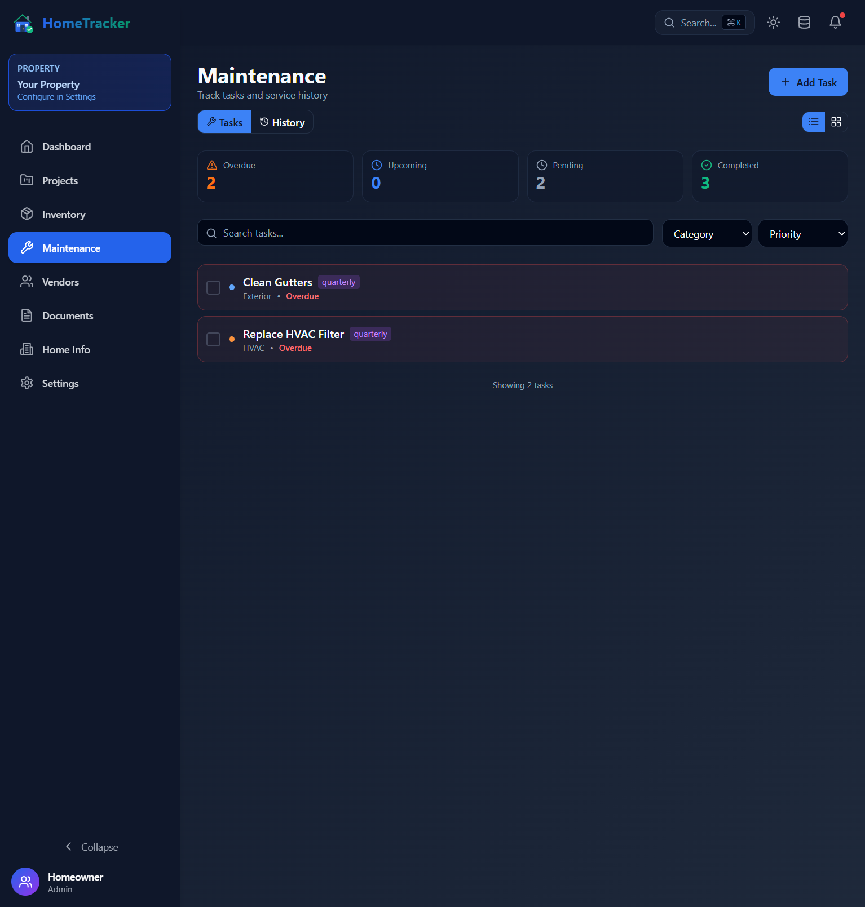
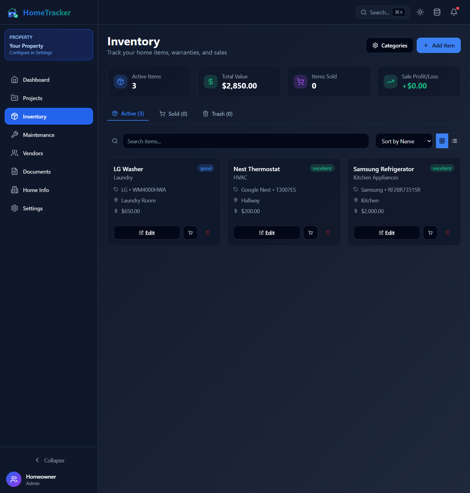

<p align="center">
  
</p>

<h1 align="center">HomeTracker</h1>

<p align="center">
  <strong>The complete home management solution for homelabbers.</strong>
</p>

<p align="center">
  Track everything about your home in one place: projects, inventory, warranties, maintenance, vendors, and more.<br>
  Self-hosted, privacy-focused, and designed for homelab deployment.
</p>

<p align="center">
  <a href="#-features">Features</a> •
  <a href="#-screenshots">Screenshots</a> •
  <a href="#-quick-start">Quick Start</a> •
  <a href="#-deployment">Deployment</a> •
  <a href="#-documentation">Documentation</a>
</p>

---

## 🏠 Why HomeTracker?

Managing a home involves tracking **a lot** of information: warranty expiration dates, maintenance schedules, project budgets, vendor contacts, paint colors, and more. HomeTracker brings it all together in one place.

**Built for homelabbers**, HomeTracker is:
- **Self-hosted** - Your data stays on your server
- **Privacy-focused** - No cloud accounts, no data sharing
- **Resource-efficient** - Runs great on a Raspberry Pi
- **Docker-ready** - Single container deployment

---

## 📸 Screenshots

<table>
<tr>
<td width="50%">

### Dashboard

*At-a-glance overview of your home with quick actions*

</td>
<td width="50%">

### Project Tracker

*Kanban board with drag-and-drop, budgets, and progress tracking*

</td>
</tr>
<tr>
<td width="50%">

### Maintenance

*Schedule tasks, track service history, manage recurring maintenance*

</td>
<td width="50%">

### Inventory

*Track appliances with warranties, values, and sale tracking*

</td>
</tr>
</table>

---

## ✨ Features

### 📋 Core Modules

| Module | Description |
|--------|-------------|
| **Dashboard** | At-a-glance overview with quick actions |
| **Projects** | Kanban board with subtasks, budgets, progress tracking, and tags |
| **Inventory** | Track items with warranties, sell tracking, and soft delete |
| **Maintenance** | Schedule tasks with priorities, recurrence, and service history |
| **Vendors** | Directory of contractors with custom categories |
| **Documents** | Store files with OCR search capability |
| **Home Info** | Property details, value tracking, paint colors, emergency contacts |
| **Settings** | App configuration, data management, backup options |

### 🚀 Key Capabilities

- **🌙 Dark/Light Mode** - Beautiful UI with full theme support
- **📱 Responsive** - Works on desktop, tablet, and mobile
- **🔍 Global Search** - Find anything with `Ctrl+K`
- **📊 Excel Export** - All data synced to `.xlsx` in real-time
- **📄 File Storage** - Upload receipts, manuals, photos
- **🔍 OCR Search** - Extract text from images automatically
- **🐳 Docker Ready** - Single container deployment

---

## 🚀 Quick Start

### Docker (Recommended)

```bash
# Clone the repository
git clone https://github.com/tomstetson/HomeTracker.git
cd HomeTracker

# Start with Docker Compose
docker-compose up -d

# Access at http://localhost:8080
```

### Development

```bash
# Clone the repository
git clone https://github.com/tomstetson/HomeTracker.git
cd HomeTracker

# Start backend
cd backend && npm install && npm run dev

# Start frontend (new terminal)
cd frontend && npm install && npm run dev

# Access at http://localhost:3000
```

---

## 🐳 Deployment

HomeTracker is designed for homelab deployment. All data persists in the `./data` directory.

```yaml
# docker-compose.yml
version: '3.8'
services:
  hometracker:
    build: .
    ports:
      - "8080:80"
    volumes:
      - ./data:/app/backend/data
      - ./backups:/app/backups
    restart: unless-stopped
```

### Data Files

| File | Description |
|------|-------------|
| `hometracker.json` | Primary data file (auto-saved) |
| `hometracker.xlsx` | Excel export (auto-generated) |
| `uploads/` | Uploaded documents and images |
| `backups/` | Automated backups |

### Backup

```bash
# Manual backup
./docker/backup.sh

# Automated backup (crontab)
0 2 * * * /path/to/hometracker/docker/backup.sh
```

---

## 📚 Documentation

| Document | Description |
|----------|-------------|
| [Quick Start](docs/QUICKSTART.md) | 5-minute setup guide |
| [Deployment](docs/DEPLOYMENT.md) | Full deployment guide |
| [Storage Options](docs/STORAGE_OPTIONS.md) | Local, NAS, and cloud storage |
| [Backup Strategy](docs/BACKUP_STRATEGY.md) | 3-2-1 backup best practices |
| [Homelab Architecture](docs/HOMELAB_ARCHITECTURE.md) | Docker vs VM guide |
| [File Storage](docs/FILE_STORAGE.md) | Document storage & OCR |

---

## 🛠 Tech Stack

| Layer | Technology |
|-------|------------|
| Frontend | React 18, TypeScript, Vite, Tailwind CSS, Zustand |
| Backend | Node.js, Express.js, ExcelJS, Tesseract.js (OCR) |
| Storage | JSON files + Excel export |
| Deployment | Docker, Nginx, Supervisor |

---

## 🤝 Contributing

Contributions are welcome! Please feel free to submit a Pull Request.

1. Fork the repository
2. Create your feature branch (`git checkout -b feature/AmazingFeature`)
3. Commit your changes (`git commit -m 'Add some AmazingFeature'`)
4. Push to the branch (`git push origin feature/AmazingFeature`)
5. Open a Pull Request

---

## 📄 License

This project is licensed under the MIT License - see the [LICENSE](LICENSE) file for details.

---

<p align="center">
  Made with ❤️ for homeowners and homelabbers
</p>
