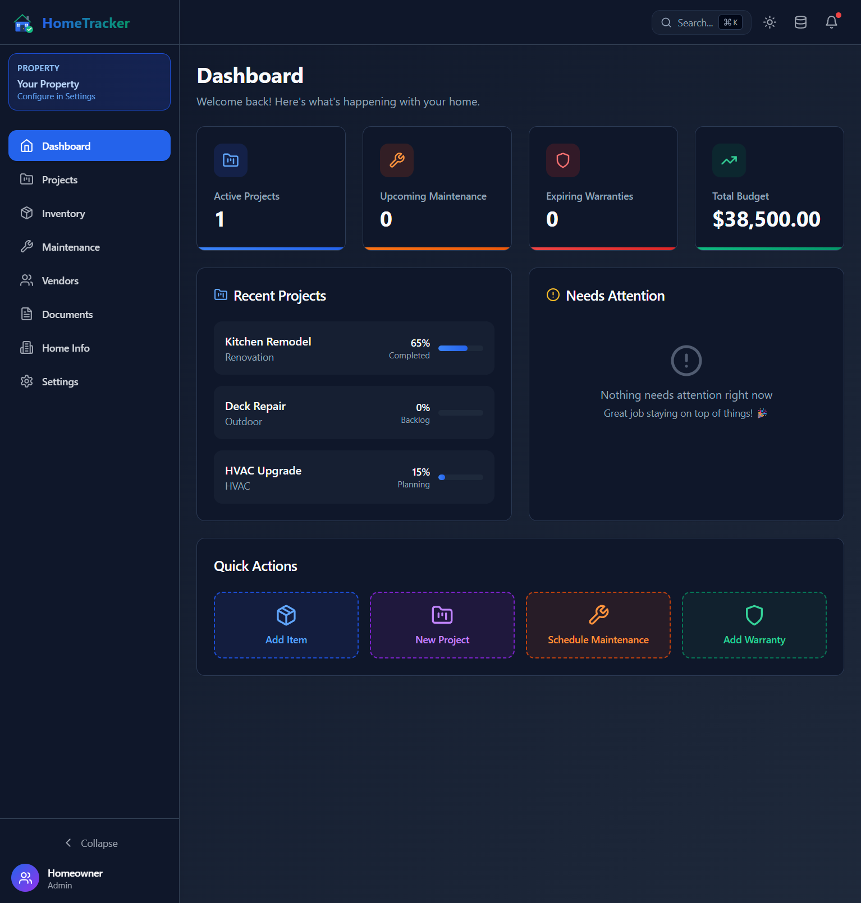
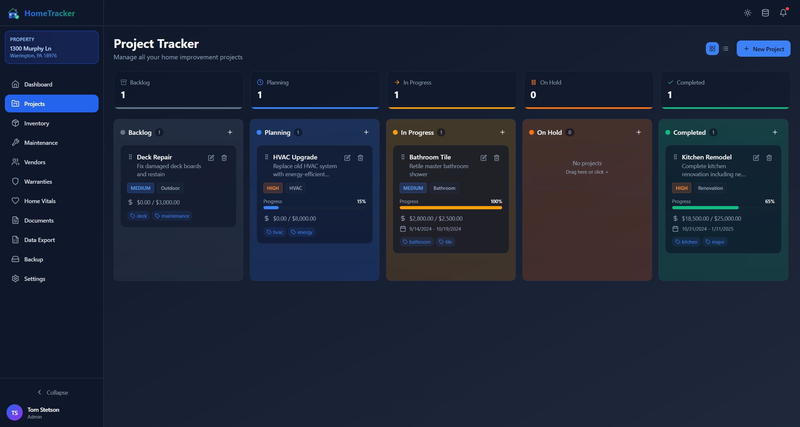

<p align="center">
  
</p>

<h1 align="center">HomeTracker</h1>

<p align="center">
  <strong>The complete home management solution for homelabbers.</strong>
</p>

<p align="center">
  Track everything about your home in one place: projects, inventory, warranties, maintenance, vendors, and more.<br>
  Self-hosted, privacy-focused, and designed for homelab deployment.
</p>

<p align="center">
  <a href="#features">Features</a> •
  <a href="#quick-start">Quick Start</a> •
  <a href="#screenshots">Screenshots</a> •
  <a href="#deployment">Deployment</a> •
  <a href="#documentation">Documentation</a>
</p>

---

## Screenshots

<p align="center">
  
  <em>Dashboard - Overview of your home at a glance</em>
</p>

<p align="center">
  
  <em>Project Tracker - Kanban board for home improvement projects</em>
</p>

<p align="center">
  
  <em>Full Dark Mode Support</em>
</p>

## Features

### 📋 Core Modules
- **Project Tracker** - Kanban board with drag-and-drop, budgets, progress tracking, and tags
- **Inventory** - Track appliances, furniture, electronics with locations and values
- **Maintenance** - Schedule tasks with priorities and due dates
- **Vendors** - Directory of contractors, service providers, and suppliers
- **Warranties** - Never miss a warranty expiration again
- **Home Vitals** - Emergency shutoffs, paint colors, HVAC filter info, service history
- **Documents** - Store manuals, receipts, and important documents with **OCR search**
- **Data Export** - View and download real-time Excel reports

### ✨ Technical Features
- 🌙 **Dark/Light Mode** - Beautiful UI with full theme support
- 📱 **Responsive Design** - Works great on desktop, tablet, and mobile
- 🔄 **Auto-Sync** - Automatic data synchronization between browser and server
- 💾 **Excel Export** - All data synced to `.xlsx` in real-time
- 📄 **File Storage** - Upload receipts, manuals, photos with persistent storage
- 🔍 **OCR Search** - Automatically extract text from images for searchability
- 🐳 **Docker Ready** - Single container deployment
- 🔒 **Self-Hosted** - Your data stays on your server

## Quick Start

### Docker (Recommended)

```bash
# Clone the repository
git clone https://github.com/tomstetson/HomeTracker.git
cd HomeTracker

# Start with Docker Compose
docker-compose up -d

# Access at http://localhost:8080
```

### Development

```bash
# Clone the repository
git clone https://github.com/tomstetson/HomeTracker.git
cd HomeTracker

# Start backend
cd backend && npm install && npm run dev

# Start frontend (new terminal)
cd frontend && npm install && npm run dev

# Access at http://localhost:3000
```

## Deployment

HomeTracker is designed for homelab deployment:

```yaml
# docker-compose.yml
version: '3.8'
services:
  hometracker:
    image: hometracker:latest
    ports:
      - "8080:80"
    volumes:
      - ./data:/app/backend/data
      - ./backups:/app/backups
    restart: unless-stopped
```

### Data Persistence

All data is stored in the `./data` directory:
- `hometracker.json` - Primary data file
- `hometracker.xlsx` - Excel export (auto-generated)

### Backup

```bash
# Manual backup
./docker/backup.sh

# Automated backup (crontab)
0 2 * * * /path/to/hometracker/docker/backup.sh
```

## Documentation

| Document | Description |
|----------|-------------|
| [Quick Start](docs/QUICKSTART.md) | 5-minute setup guide |
| [Deployment](docs/DEPLOYMENT.md) | Full deployment guide |
| [Storage Options](docs/STORAGE_OPTIONS.md) | Local, NAS, and cloud storage |
| [Backup Strategy](docs/BACKUP_STRATEGY.md) | 3-2-1 backup best practices |
| [Homelab Architecture](docs/HOMELAB_ARCHITECTURE.md) | Docker vs VM guide |
| [Roadmap](docs/V1_ROADMAP.md) | Feature roadmap |
| [File Storage](docs/FILE_STORAGE.md) | Document storage & OCR |

## Tech Stack

| Layer | Technology |
|-------|------------|
| Frontend | React 18, Vite, Tailwind CSS, Zustand |
| Backend | Node.js, Express.js, ExcelJS |
| Storage | JSON files + Excel export |
| Deployment | Docker, Nginx, Supervisor |

## Contributing

Contributions are welcome! Please feel free to submit a Pull Request.

1. Fork the repository
2. Create your feature branch (`git checkout -b feature/AmazingFeature`)
3. Commit your changes (`git commit -m 'Add some AmazingFeature'`)
4. Push to the branch (`git push origin feature/AmazingFeature`)
5. Open a Pull Request

## License

This project is licensed under the MIT License - see the [LICENSE](LICENSE) file for details.

## Acknowledgments

- Built for the homelab community
- Inspired by the need for a simple, self-hosted home management solution

---

<p align="center">
  Made with ❤️ for homeowners and homelabbers
</p>
